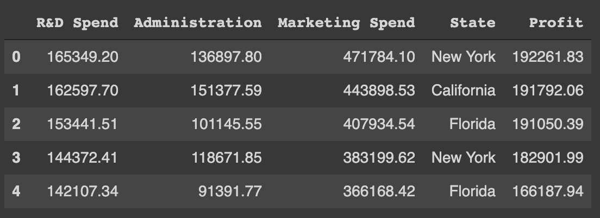

# Estimating the company's profit using the Linear Regression model.
This repository contains the implementation of one of the supervised learning model called linear regression in predicting the total profit of the company based on their different expenditures.

## Problem Statement
The US-based multinational company has three branches in different locations, i.e. New York, California, Florida. The company is spending its share in Research & Development, Administration and Marketing and making a total profit from these different expenditures. Now, the company would like to know how can they maximise the profit by spending their share in fair amount among different expenditures at different locations.

## Packages
This project is implemented in python. The following python-based packages are used:

* **skikit-learn** : It is a collection of simple and efficient tools for predictive data analysis using supervised and unsupervised machine learning algorithms. It also contains the tools for data preprocessing, which is needed since the collected data is not always in the format which is required by the model. So, a little bit of preprocessing is needed to the dataset. In this project, `OneHotEncoder` and `ColumnTransformer` are used to process the categorical data into labels. [More Information](https://scikit-learn.org/stable/index.html)

* **pandas** : It is a collection of tools for reading and writing data between in-memory data structures and different formats like CSV, text files, Microsoft Excel, SQL databases, and the fast HDF5 format. It uses a fast and efficient DataFrame object for data manipulation with integrated indexing. In this project, it is used to import the dataset, which is a CSV file. [More Information](https://pandas.pydata.org/)

* **numpy** : It is the fundamental package for scientific computing with python. It offers comprehensive mathematical functions, random number generators, linear algebra routines, Fourier transforms, and more. It provides powerful N-dimensional array, which is fast and versatile in the vectorisation, indexing, and broadcasting concepts for computing. In this project, the NumPy array is used to store the preprocessed dataset and perform mathematical operations. [More Information](https://numpy.org/)

* **matplotlib** : It is a comprehensive library for creating static, animated, and interactive visualisations in python. It also offers 3D interactive plotting which can be zoomed, panned and updated. In this project, it is used for plotting different variables to understand the dataset better. [More Information](https://matplotlib.org/index.html)

* **seaborn** : It is a python data visualisation library based on matplotlib. It provides a high-level interface for drawing attractive and informative statistical graphics. It is built on top of matplotlib and closely integrated with pandas data structures. It offers dataset-oriented API for examining relationships between multiple variables. In this project, it is used for plotting heatmaps. [More Information](https://seaborn.pydata.org/index.html)

## Dataset
The supervised learning is used to analyse this problem for which a labelled data is required to train the model. The data is collected from the company, which tells the profit they are making from investing their shares in different expenditures. The data consists of 5 columns and 1000 rows. The sample of the first five rows are shown below by using `company.head()` command.

## Implemented Techniques

## Result